# Long Health Phase 1 MVP — User Journey Workflows

**Document Version:** 1.0  
**Last Updated:** 2026-04-08  
**Scope:** Phase 1 (Free MVP — Android, iOS, Web)  
**Target User:** Health-curious urban Indian, 25-50, mostly Android users  

---

## Overview

This document maps all critical user flows for Long Health Phase 1, detailing step-by-step actions, system responses, decision points, error handling, and analytics tracking. Each flow includes a Mermaid diagram for visual clarity.

**Key Product Principles:**
- Everything is **FREE** in Phase 1 (no payments, no paywalls)
- **Phone OTP authentication** (Indian mobile numbers)
- **PDF upload** from Indian labs (Thyrocare, Metropolis, Apollo, etc.)
- **AI-powered analysis** with interactive health dashboard
- **Organ system scores** + **prioritized concerns** + **recommendations**
- **Trend tracking** across multiple reports
- Processing time: **< 60 seconds** per report

---

## 1. First-Time User Flow (Onboarding)

### User Goal
New user downloads the app, verifies their identity, and completes profile setup to enable personalized health analysis.

### Flow Steps

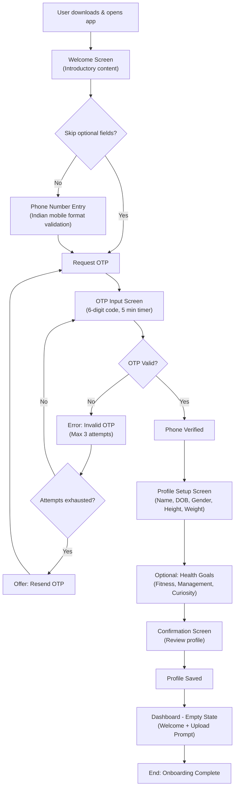

### Detailed Steps

| Step | User Action | System Response | Error Handling | Analytics Event |
|------|-------------|-----------------|-----------------|-----------------|
| 1 | User opens app (first time) | Display welcome screen with "Get Started" button | N/A | `onboarding_started` |
| 2 | Tap "Get Started" | Navigate to phone number entry | N/A | `phone_entry_view` |
| 3 | Enter phone number (10 digits) | Validate format (10 digits, Indian +91) | Show inline error: "Please enter valid 10-digit number" | `phone_number_entered` |
| 4 | Tap "Send OTP" | Trigger SMS delivery, show OTP input screen, start 5-min countdown timer | Network error → Show retry button | `otp_requested` |
| 5 | Enter 6-digit OTP | Verify against backend | Invalid OTP (max 3 attempts) → Show error message + "Resend OTP" option | `otp_submitted` |
| 6 | Complete OTP verification | Phone verified ✓, navigate to profile setup | After 3 failed attempts: Lock screen, offer "Resend OTP" button | `otp_verified` |
| 7 | Enter name | Auto-capitalize first letter | Non-empty validation | `profile_name_entered` |
| 8 | Select date of birth (DOB picker) | Show calendar, default to 30 years ago | Age must be 18+ | `profile_dob_selected` |
| 9 | Select gender (radio buttons) | Options: Male, Female, Other | Required field | `profile_gender_selected` |
| 10 | Enter height (cm) | Validate range 100-250 cm | Show error: "Height must be between 100-250 cm" | `profile_height_entered` |
| 11 | Enter weight (kg) | Validate range 30-200 kg | Show error: "Weight must be between 30-200 kg" | `profile_weight_entered` |
| 12 | View profile summary | Show all entered fields for review | Allow edit individual fields | `profile_review_viewed` |
| 13 | Tap "Complete Setup" | Save to database, generate JWT token, navigate to dashboard | Validation error → Show which field failed | `profile_created` |
| 14 | Land on dashboard | Show empty state with "Upload Your First Report" CTA | N/A | `onboarding_completed`, `dashboard_viewed` |

### Empty State UX

**Empty Dashboard View:**
- Headline: "You're all set! 🎉"
- Subheading: "Upload your blood test report to get personalized health insights"
- Large upload button with camera/file picker icons
- Informational card: "Supported labs: Thyrocare, Metropolis, Apollo, DMRC, Max, SRL..."
- Help link: "How to upload your report"

### Skip Options
- **Optional Fields:** Users can skip "Health Goals" during initial setup
- **Profile Photo:** Not required in Phase 1
- **All other fields (name, DOB, gender, height, weight):** Required for accurate health analysis

### UX Notes
- Keep onboarding **< 2 minutes** total
- Pre-fill country code as +91
- Use native phone/date pickers for mobile
- Show visual progress indicator (Step 1 of 4, etc.)
- Highlight required fields with asterisk (*)
- Allow going back to previous steps before final confirmation

### Analytics Events
- `onboarding_started`
- `phone_entry_view`
- `phone_number_entered`
- `otp_requested`
- `otp_submit_failed` (with error reason)
- `otp_verified`
- `profile_name_entered`
- `profile_dob_selected`
- `profile_gender_selected`
- `profile_height_entered`
- `profile_weight_entered`
- `profile_review_viewed`
- `profile_created`
- `onboarding_completed`

### Accessibility Notes
- Use semantic HTML labels for all form fields
- Ensure phone number field accepts formatted input (with dashes)
- Date picker must be keyboard navigable
- OTP input: Allow auto-fill from SMS (iOS UIPasteboard, Android SMS Retriever API)
- Minimum touch target: 48×48 dp
- High contrast for error messages (red text, 4.5:1 ratio)

---

## 2. Report Upload & Analysis Flow (Core Product Flow)

### User Goal
User uploads a blood test PDF, system extracts biomarker data via OCR, user reviews extracted values, and AI provides comprehensive analysis.

### Flow Steps

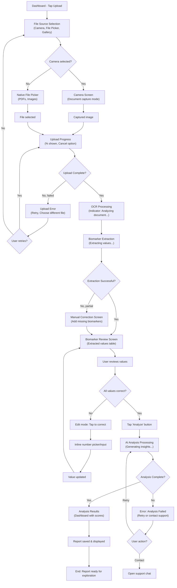

### Detailed Steps

| Step | User Action | System Response | Error Handling | Analytics Event |
|------|-------------|-----------------|-----------------|-----------------|
| 1 | Tap "Upload Report" on dashboard | Show source selection sheet: Camera, Choose from gallery, Choose file | N/A | `upload_initiated` |
| 2a | Select "Camera" | Launch camera in document capture mode (emphasize rectangular frame) | Camera permission denied → Show permission request dialog | `camera_selected` |
| 2b | Select "Choose from gallery" | Open native image/PDF picker | Permission denied → Show permission request | `gallery_selected` |
| 2c | Select "Choose file" | Open file picker (PDFs, images) | Permission denied → Show permission request | `file_picker_selected` |
| 3 | Capture or select file | Show upload progress bar (0-100%) with file name | Network timeout after 30s → Show "Retry" button; file too large (>50MB) → "File too large" error | `file_selected` |
| 4 | Wait for upload | Real-time progress indicator; allow cancel | Canceled → Return to upload screen | `upload_progress` |
| 5 | Upload completes | Show "Analyzing document..." with spinner | Upload failed → Show error, offer retry or different file | `upload_completed` |
| 6 | OCR processing starts | Display loading screen: "Extracting biomarkers from your report..." (3-10 seconds) | Timeout → "OCR processing timeout, please retry" | `ocr_started` |
| 7 | OCR completes | Extract biomarkers table with values (name, value, unit, reference range) | Partial extraction (< 50% biomarkers found) → Navigate to manual entry screen | `ocr_completed` |
| 8 | Biomarker review screen | Display extracted data in table format: Biomarker | Value | Unit | Ref Range | Allow edit by tapping row | N/A | `biomarker_review_viewed` |
| 9 | User reviews values | Can scroll through table, see which biomarkers were extracted | N/A | `biomarker_review_scrolled` |
| 10 | Tap biomarker row to edit | Open inline number picker or text input | Invalid input (non-numeric) → Show error with hint | `biomarker_edit_started` |
| 11 | Enter corrected value | Update value in table | Validate range (not < 0 for most, age-gender specific for some) | `biomarker_value_corrected` |
| 12 | Confirm all values | Tap "These values look correct" or similar | All visible biomarkers must have values | `biomarker_review_confirmed` |
| 13 | Tap "Analyze" button | Submit to AI analysis backend, show "Generating your health insights..." | Network error → Offer retry | `analysis_requested` |
| 14 | AI analysis processes | Backend runs: biomarker interpretation, organ system scoring, concern prioritization, recommendations (30-60 seconds) | Timeout after 120s → Show error, allow retry | `analysis_processing` |
| 15 | Analysis complete | Navigate to dashboard with new report results displayed | N/A | `analysis_completed` |

### Processing Time Expectations
- **File upload:** < 10 seconds
- **OCR extraction:** 3-10 seconds
- **AI analysis:** 30-60 seconds
- **Total end-to-end:** < 90 seconds

### Error Branches

#### Upload Failed
- **Network Error:** Retry button with connection status check
- **File Too Large (>50MB):** "Please upload a file smaller than 50 MB"
- **Unsupported Format:** "Please upload a PDF or image file (JPG, PNG, TIFF)"
- **Corrupted File:** "The file appears to be corrupted. Please try another file"

#### OCR Extraction Failed
- **No biomarkers found:** "We couldn't extract biomarkers from this report. Please ensure it's a blood test report from an Indian lab and try again."
- **Partial extraction (< 50%):** Auto-navigate to manual entry screen; allow user to add missing biomarkers
- **Document quality poor:** Suggest re-upload with clearer image

#### AI Analysis Failed
- **Backend timeout:** "Analysis is taking longer than expected. Please try again in a moment."
- **Insufficient data:** "We need at least 5 biomarkers to generate analysis. Please review and add missing values."
- **Unknown error:** "Something went wrong. Please contact our support team." (Show support chat button)

### Manual Biomarker Correction
**When partial extraction occurs:**
1. Show extracted biomarkers table with indication of missing data
2. Display "Add more biomarkers" section below
3. Allow search/autocomplete for biomarker names (Hemoglobin, Glucose, etc.)
4. Require value + unit for each biomarker
5. Validate against lab reference ranges (display range hints)

### File Type Support
- **Preferred:** PDF documents
- **Supported:** JPG, PNG, TIFF images
- **Lab support:** Thyrocare, Metropolis, Apollo, DMRC, Max, SRL, Dr. Lal PathLabs, Ganesh Diagnostic

### UX Notes
- Show upload icon animation during processing
- Use progress ring/spinner instead of progress bar for OCR (indeterminate state)
- Display estimated time: "This usually takes 30-60 seconds"
- Allow landscape mode for camera capture
- Provide clear visual feedback for each processing stage
- Show biomarker extraction as a table with scroll for long lists
- Highlight newly extracted biomarkers vs. manually corrected ones

### Analytics Events
- `upload_initiated`
- `camera_selected` / `gallery_selected` / `file_picker_selected`
- `camera_permission_requested` / `gallery_permission_requested`
- `file_selected` (with file name, size, format)
- `upload_progress` (with % complete)
- `upload_completed` / `upload_failed` (with error code)
- `ocr_started`
- `ocr_completed` (with # biomarkers found)
- `ocr_failed` (with error reason)
- `biomarker_review_viewed` (with # biomarkers shown)
- `biomarker_review_scrolled`
- `biomarker_edit_started` (with biomarker name)
- `biomarker_value_corrected` (with biomarker name, old value, new value)
- `biomarker_review_confirmed` (with # biomarkers final)
- `analysis_requested` (with report date)
- `analysis_processing` (with elapsed time)
- `analysis_completed` (with processing time)
- `analysis_failed` (with error code)

### Accessibility Notes
- Camera capture: Provide clear rectangular frame overlay (accessible via VoiceOver)
- File picker: Support keyboard navigation and screen readers
- Progress indicators: Use ARIA live regions to announce progress
- Biomarker table: Each row is a button; screen reader announces "Edit [biomarker name], value [X]"
- Input fields: Use semantic HTML labels, hint text in description
- Error messages: High contrast (red), announced via ARIA alerts
- Minimum touch target for edit buttons: 48×48 dp

---

## 3. Dashboard Exploration Flow

### User Goal
User explores their health analysis results, navigates between organ systems, views biomarker details, and discovers trends.

### Flow Steps

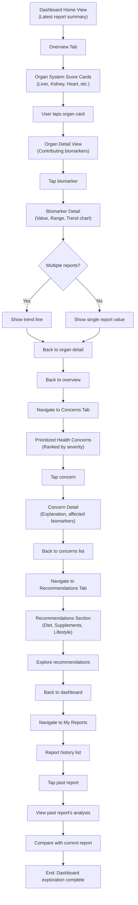

### Detailed Steps

#### Overview Tab

| Step | User Action | System Response | Notes | Analytics Event |
|------|-------------|-----------------|-------|-----------------|
| 1 | Land on dashboard | Display overview with latest report summary | Show report date, number of reports | `dashboard_viewed` |
| 2 | View organ system scores | Show 4-6 organ score cards (Liver, Kidney, Heart, Lungs, etc.) as color-coded rings or bars | Green (healthy), Yellow (mild concern), Red (moderate concern) | `organ_scores_viewed` |
| 3 | Tap organ card | Navigate to organ detail view | Smooth transition animation | `organ_tapped` (with organ name) |
| 4 | View organ detail | Show contributing biomarkers table with values, ranges, and color-coded status | Show explanation of organ significance | `organ_detail_viewed` |
| 5 | Tap biomarker row | Navigate to biomarker detail view | Biomarker name, value, reference range, interpretation | `biomarker_detail_opened` |
| 6 | View biomarker detail | Display: value, unit, reference range, interpretation text, trend chart (if multiple reports) | If single report: show static value; if multiple: show trend line | `biomarker_detail_viewed` |
| 7 | View trend chart | Show line chart with dates on X-axis, biomarker values on Y-axis | If only 1 report: show "Upload another report to see trends" prompt | `trend_chart_viewed` |
| 8 | Back navigation | Return to organ detail, then overview | Maintain scroll position on return | `back_tapped` |

#### Concerns Tab

| Step | User Action | System Response | Notes | Analytics Event |
|------|-------------|-----------------|-------|-----------------|
| 1 | Tap "Concerns" tab | Display ranked list of health concerns by severity | Top 3-5 concerns shown; scroll for more | `concerns_tab_viewed` |
| 2 | View concern card | Show: Concern name, severity badge, affected biomarkers, action prompt | Severity: Mild, Moderate, Significant | `concern_card_viewed` |
| 3 | Tap concern | Navigate to concern detail view | Smooth slide transition | `concern_tapped` |
| 4 | View concern detail | Show: Full explanation, affected biomarkers table, recommended actions, suggested diet/supplements | Link to related recommendations | `concern_detail_viewed` |
| 5 | Tap "View recommendations" | Navigate to Recommendations tab with auto-scroll to relevant section | Pre-filter recommendations by concern | `concern_to_recommendations_tapped` |
| 6 | Back to concerns | Return to concerns list | Maintain scroll position | `back_tapped` |

#### Recommendations Tab

| Step | User Action | System Response | Notes | Analytics Event |
|------|-------------|-----------------|-------|-----------------|
| 1 | Tap "Recommendations" tab | Display recommendations grouped by category: Diet, Supplements, Lifestyle | Show India-specific foods and brands | `recommendations_tab_viewed` |
| 2 | Expand diet section | Show 5-10 recommended foods with explanations | Include local Indian foods and cuisines | `diet_section_expanded` |
| 3 | Tap food item | Show detail: Benefits, biomarker impact, serving suggestions | Recipes link (Phase 2) | `food_item_tapped` |
| 4 | Expand supplements section | Show suggested supplements with dosage, duration, interaction notes | Include Ayurvedic alternatives | `supplements_section_expanded` |
| 5 | Tap supplement | Show detail: Dosage, frequency, duration, precautions, interaction warnings | Link to "Where to buy" (Phase 2) | `supplement_tapped` |
| 6 | Expand lifestyle section | Show exercise, sleep, stress management recommendations | Personalized based on age/gender | `lifestyle_section_expanded` |
| 7 | Tap lifestyle item | Show detail: Instructions, frequency, expected timeline for improvement | Links to fitness/meditation apps (Phase 2) | `lifestyle_item_tapped` |

#### My Reports Tab

| Step | User Action | System Response | Notes | Analytics Event |
|------|-------------|-----------------|-------|-----------------|
| 1 | Tap "My Reports" tab | Show chronological list (newest first) of all uploaded reports | Show report date, total biomarkers, key findings | `reports_tab_viewed` |
| 2 | View single report | Show date, lab name (if extracted), number of biomarkers | Allow quick actions: View, Download, Delete | `report_listed` |
| 3 | Tap report | Navigate to that report's analysis view | Display all tabs for that report | `report_tapped` |
| 4 | View past report | Show overview/concerns/recommendations for that specific report | All tabs available | `past_report_viewed` |
| 5 | Tap "Compare" button | If multiple reports exist: Show comparison view | Display trend chart for all biomarkers across all reports | `compare_tapped` |
| 6 | View comparison | Show side-by-side tables and trend charts | Filter by organ system or biomarker category | `comparison_viewed` |
| 7 | Back to latest report | Tap "Latest Report" button or back arrow | Return to most recent report's analysis | `back_tapped` |

### Single Report vs. Multiple Reports Behavior

**With 1 Report:**
- Dashboard shows that report's data
- Trend charts display: "Upload another report to start seeing trends"
- Concerns and recommendations based on single snapshot
- "My Reports" tab shows only 1 report

**With Multiple Reports (2+):**
- Dashboard shows latest report with trend indicators
- Trend charts display line charts across all report dates
- Ability to compare reports
- "My Reports" shows all in chronological order
- "See improvement" badges if metrics improved

### Navigation Structure
```
Dashboard
├── Overview Tab
│   ├── Organ System Scores
│   └── Biomarker Details (with trends)
├── Concerns Tab
│   ├── Prioritized Concerns
│   └── Concern Details
├── Recommendations Tab
│   ├── Diet
│   ├── Supplements
│   └── Lifestyle
├── My Reports Tab
│   ├── Report List
│   ├── Report Details
│   └── Comparison (if 2+ reports)
└── Settings (separate)
```

### UX Notes
- Use bottom tab navigation for main sections
- Color-code organ scores: Green (0-3), Yellow (3-6), Red (6-10) on health risk scale
- Show report date prominently on each view
- Enable horizontal scrolling for biomarker comparison tables
- Use smooth page transitions (slide or fade)
- Provide "Upload Next Report" CTA prominently on dashboard
- Show last report date with retest recommendation (e.g., "Retest recommended in 3 months")
- Biomarker trends: Show % change from previous report (e.g., "↓ 12% improvement")

### Analytics Events
- `dashboard_viewed` (with # reports, last report date)
- `organ_scores_viewed` (with # organs shown)
- `organ_tapped` (with organ name)
- `organ_detail_viewed` (with # biomarkers)
- `biomarker_detail_opened` (with biomarker name)
- `biomarker_detail_viewed` (with # reports, trend availability)
- `trend_chart_viewed` (with # data points)
- `concerns_tab_viewed` (with # concerns)
- `concern_card_viewed` (with concern name, severity)
- `concern_tapped` (with concern name)
- `concern_detail_viewed` (with # affected biomarkers)
- `recommendations_tab_viewed` (with # recommendations)
- `diet_section_expanded` (with # foods shown)
- `food_item_tapped` (with food name)
- `supplements_section_expanded` (with # supplements)
- `supplement_tapped` (with supplement name)
- `lifestyle_section_expanded` (with # items)
- `lifestyle_item_tapped` (with item name)
- `reports_tab_viewed` (with # reports)
- `report_tapped` (with report date)
- `past_report_viewed` (with report date)
- `compare_tapped`
- `comparison_viewed` (with # reports compared)

### Accessibility Notes
- Tab navigation: Ensure keyboard support (Tab to focus each tab, Enter to switch)
- Organ cards: Use semantic buttons, announce health status in label
- Biomarker table: Use ARIA table markup, screen reader announces "Row [N], [biomarker], value [X]"
- Trend chart: Provide data table alternative below chart
- Severity badges: Use both color and text (not color alone)
- Recommendation lists: Use unordered lists with proper heading hierarchy
- Touch targets: Minimum 48×48 dp for all interactive elements
- Focus indicators: Visible 2px outline for keyboard navigation

---

## 4. Health Concerns & Recommendations Flow

### User Goal
User understands their health concerns in priority order, sees which biomarkers are affected, and receives actionable recommendations personalized to Indian context.

### Flow Steps

```mermaid
flowchart TD
    A["Concerns Tab Selected"] --> B["Concerns List Loaded\n(Sorted by severity)"]
    B --> C["View concern card\n(Name, severity, quick description)"]
    C --> D["Tap concern card"]
    D --> E["Concern Detail Screen"]
    E --> F["Read full explanation\n(Why this concern matters)"]
    F --> G["View affected biomarkers\n(Table: name, value, range, status)"]
    G --> H["View impact explanation\n(Why these biomarkers indicate concern)"]
    H --> I["View recommended actions\n(Diet, Supplements, Lifestyle)"]
    I --> J["Tap 'View diet recommendations'"]
    J --> K["Diet Section\n(India-specific foods, cuisines)"]
    K --> L["Browse recommended foods"]
    L --> M{User wants details?}
    M -->|Yes| N["Food Detail\n(Benefits, biomarker impact)"]
    N --> O["Back to diet list"]
    M -->|No| P["Back to concern"]
    O --> P
    P --> Q["Tap 'View supplement recommendations'"]
    Q --> R["Supplement Section\n(Ayurvedic + Allopathic)"]
    R --> S["Browse recommended supplements"]
    S --> T{User wants details?}
    T -->|Yes| U["Supplement Detail\n(Dosage, precautions, interactions)"]
    U --> V["Back to supplement list"]
    T -->|No| W["Back to concern"]
    V --> W
    W --> X["Tap 'View lifestyle recommendations'"]
    X --> Y["Lifestyle Section\n(Exercise, sleep, stress, diet changes)"]
    Y --> Z["Browse lifestyle items"]
    Z --> AA{User wants details?}
    AA -->|Yes| AB["Lifestyle Detail\n(How-to, frequency, timeline)"]
    AB --> AC["Back to lifestyle list"]
    AA -->|No| AD["Back to concern"]
    AC --> AD
    AD --> AE["Tap 'Priority Concerns' back"]
    AE --> AF["Return to concerns list"]
    AF --> AG["End: Recommendations explored"]
```

### Detailed Steps

#### Concerns List View

| Step | User Action | System Response | Notes | Analytics Event |
|------|-------------|-----------------|-------|-----------------|
| 1 | View concerns list | Display 3-5 top concerns ranked by severity | Sorted: Significant → Moderate → Mild | `concerns_list_viewed` |
| 2 | Each concern card shows | Concern name, severity badge (color + text), brief description, affected biomarker count | Example: "Elevated Blood Glucose | Moderate concern | Affects 2 biomarkers" | `concern_card_displayed` |
| 3 | Scroll for more | If 5+ concerns, show "See all concerns" or infinite scroll | Less critical concerns below fold | `concerns_scrolled` |
| 4 | Tap concern card | Navigate to concern detail view | Smooth slide-in transition | `concern_detail_opened` |

#### Concern Detail View

| Step | User Action | System Response | Notes | Analytics Event |
|------|-------------|-----------------|-------|-----------------|
| 1 | Land on concern detail | Show concern name, severity badge, full explanation | Display in clear, medical-yet-accessible language | `concern_detail_viewed` |
| 2 | Read explanation | Explanation answers: What is this? Why does it matter? How serious? | Example: "Elevated Blood Glucose means your blood sugar levels are higher than normal. This can indicate prediabetes or diabetes risk." | `explanation_read` |
| 3 | View affected biomarkers | Table showing: Biomarker name | Value | Reference range | Status (Out of range, Borderline, Normal) | Highlight out-of-range values in red | `affected_biomarkers_viewed` |
| 4 | Tap biomarker row | Navigate to biomarker detail (name, explanation, trend if available) | Show why this biomarker matters for this concern | `biomarker_from_concern_tapped` |
| 5 | View recommendations section | Show 3 categories: Diet, Supplements, Lifestyle | Each category shows preview (e.g., "5 dietary recommendations") | `recommendations_section_viewed` |
| 6 | Tap "View Diet Recommendations" | Navigate to diet detail section | Filter to show only diet items relevant to this concern | `diet_recommendations_tapped` |

#### Diet Recommendations

| Step | User Action | System Response | Notes | Analytics Event |
|------|-------------|-----------------|-------|-----------------|
| 1 | View diet recommendations | Show list of 5-15 recommended foods/food types | India-specific: dal, leafy greens, whole grains, low-sugar fruits | `diet_recommendations_viewed` |
| 2 | Each food item shows | Food name, brief benefit statement, recommended frequency (daily, 3x/week, etc.) | Example: "Spinach | Rich in fiber, supports blood sugar control | Daily" | `diet_item_displayed` |
| 3 | Tap food item | Navigate to food detail view | Show expanded information | `diet_item_tapped` |
| 4 | View food detail | Food name, benefits explanation, how it impacts relevant biomarkers, serving size, preparation tips, example recipes | Provide local Indian recipe examples | `diet_item_detail_viewed` |
| 5 | Back to diet list | Return to recommendations list | Maintain scroll position | `diet_back_tapped` |
| 6 | Foods to avoid section (if applicable) | Show foods to minimize/avoid for this concern | Example: "Sugary drinks, refined white bread, fried foods" | `foods_to_avoid_viewed` |

#### Supplement Recommendations

| Step | User Action | System Response | Notes | Analytics Event |
|------|-------------|-----------------|-------|-----------------|
| 1 | View supplement recommendations | Show list of 3-8 recommended supplements | Include both Allopathic and Ayurvedic options | `supplement_recommendations_viewed` |
| 2 | Each supplement shows | Supplement name, type (Vitamin, Mineral, Herb, Ayurvedic), recommended dosage, frequency, duration | Example: "Chromium | Mineral | 200 mcg daily, 8-12 weeks" | `supplement_item_displayed` |
| 3 | Tap supplement item | Navigate to supplement detail view | Show full information and precautions | `supplement_item_tapped` |
| 4 | View supplement detail | Name, type, dosage, frequency, duration, why it helps, precautions, potential interactions, where to buy (Phase 2) | Warning: "Consult your doctor before starting any supplement" | `supplement_detail_viewed` |
| 5 | Back to supplement list | Return to recommendations list | Maintain scroll position | `supplement_back_tapped` |
| 6 | Medical disclaimer | Show: "These recommendations are based on your biomarker analysis. Consult a healthcare professional before starting any supplement." | Always visible on supplement screens | `disclaimer_viewed` |

#### Lifestyle Recommendations

| Step | User Action | System Response | Notes | Analytics Event |
|------|-------------|-----------------|-------|-----------------|
| 1 | View lifestyle recommendations | Show list of 4-10 lifestyle changes | Categories: Exercise, Sleep, Stress management, Daily habits | `lifestyle_recommendations_viewed` |
| 2 | Each item shows | Item name, category, brief description, expected timeline for improvement | Example: "30-minute walk daily | Exercise | Improves blood sugar control in 2-4 weeks" | `lifestyle_item_displayed` |
| 3 | Tap lifestyle item | Navigate to lifestyle detail view | Show detailed instructions and timeline | `lifestyle_item_tapped` |
| 4 | View lifestyle detail | Item name, category, detailed description, how-to instructions, frequency/duration, expected improvement timeline, tips for success | Example: "Meditation | Stress management | 10-15 minutes daily, reduces stress within 2 weeks" | `lifestyle_detail_viewed` |
| 5 | Back to lifestyle list | Return to recommendations list | Maintain scroll position | `lifestyle_back_tapped` |

### Severity Levels

| Severity | Color | Description | Recommendation Urgency |
|----------|-------|-------------|------------------------|
| Significant | Red | Requires medical attention, potentially serious | URGENT: See doctor; implement recommendations immediately |
| Moderate | Orange/Yellow | Notable health concern, recommend lifestyle changes | HIGH: Start recommendations within 1 week |
| Mild | Green/Blue | Minor deviation from normal, preventative measures suggested | MEDIUM: Implement within 2 weeks |

### India-Specific Content Examples

**Recommended Foods:**
- Leafy greens: Spinach (palak), fenugreek (methi), amaranth (rajgira)
- Legumes: Moong dal, chana, rajma
- Grains: Bajra, ragi, jowar, brown rice
- Spices: Turmeric (haldi), cumin (jeera), cinnamon (dalchini)
- Vegetables: Bottle gourd (lauki), bitter gourd (karela), okra (bhindi)

**Supplements:**
- Ayurvedic: Triphala, Ashwagandha, Brahmi
- Allopathic: Vitamins, minerals available at Indian pharmacies

**Lifestyle:**
- Yoga asanas (culturally relevant)
- Walking on morning/evening
- Ayurvedic practices (seasonal eating, Dinacharya)

### UX Notes
- Use color-coding for severity (Red, Orange, Green)
- Show concern count badge on tab (e.g., "Concerns (3)")
- Provide "Save for later" option for recommendations (Phase 2)
- Show medical disclaimers prominently
- India-localize all food, supplement, and lifestyle recommendations
- Allow searching/filtering concerns by organ system
- Show "Print recommendations" option for doctor consultation

### Analytics Events
- `concerns_list_viewed` (with # concerns)
- `concern_card_displayed` (with concern name, severity)
- `concern_detail_opened` (with concern name)
- `concern_detail_viewed` (with concern name, # affected biomarkers)
- `explanation_read` (with concern name)
- `affected_biomarkers_viewed` (with concern name, # biomarkers)
- `biomarker_from_concern_tapped` (with biomarker name, concern)
- `recommendations_section_viewed` (with concern name)
- `diet_recommendations_tapped` (with concern name)
- `diet_recommendations_viewed` (with # foods)
- `diet_item_displayed` (with food name)
- `diet_item_tapped` (with food name, concern)
- `diet_item_detail_viewed` (with food name)
- `foods_to_avoid_viewed` (with concern name, # foods)
- `supplement_recommendations_tapped` (with concern name)
- `supplement_recommendations_viewed` (with # supplements)
- `supplement_item_displayed` (with supplement name)
- `supplement_item_tapped` (with supplement name, concern)
- `supplement_detail_viewed` (with supplement name)
- `lifestyle_recommendations_tapped` (with concern name)
- `lifestyle_recommendations_viewed` (with # items)
- `lifestyle_item_displayed` (with item name)
- `lifestyle_item_tapped` (with item name, concern)
- `lifestyle_detail_viewed` (with item name)
- `disclaimer_viewed` (with section)

### Accessibility Notes
- Concern severity: Use both color and text badge (red badge with "Significant" text, not color alone)
- Concern cards: Semantic buttons, announce severity level
- Biomarker table: ARIA table markup, announce row content ("Glucose, 145 mg/dL, above range")
- Food/supplement/lifestyle items: List semantics with proper heading hierarchy
- Color contrast: All text 4.5:1 ratio minimum
- Touch targets: 48×48 dp minimum
- Recommendation categories: Use heading tags (H2, H3) for proper outline
- Medical disclaimers: High contrast, clear and prominent

---

## 5. Report History & Trend Tracking Flow

### User Goal
User views all past reports, revisits individual reports, and tracks biomarker trends across multiple uploads.

### Flow Steps

```mermaid
flowchart TD
    A["Dashboard - Tap 'My Reports'"] --> B["Reports List View"]
    B --> C["Chronological list\n(Newest first)"]
    C --> D{Multiple reports?}
    D -->|1 report only| E["Single report shown"]
    D -->|2+ reports| F["Multiple reports listed"]
    E --> G["Tap report"]
    F --> G
    G --> H["Report Detail View\n(Same analysis as upload)"]
    H --> I["View Overview tab"]
    I --> J["View Concerns tab"]
    J --> K["View Recommendations tab"]
    K --> L["Tap 'Compare' button"]
    L --> M{Conditions met?\n(2+ reports)}
    M -->|No| N["Show 'Upload another report\nto compare' prompt"]
    N --> O["End: Single report view"]
    M -->|Yes| P["Comparison View Loaded"]
    P --> Q["Biomarker Trend Charts\n(All reports superimposed)"]
    Q --> R["Select biomarker to focus"]
    R --> S["Zoomed trend chart\n(Single biomarker across all reports)"]
    S --> T["View summary:\nTrend direction (↑↓→), % change"]
    T --> U["Filter by organ system\n(Optional)"]
    U --> V["View improvement/decline\n(Badges per biomarker)"]
    V --> W["Back to latest report"]
    W --> X["End: Trend review complete"]
```

### Detailed Steps

#### My Reports List

| Step | User Action | System Response | Notes | Analytics Event |
|------|-------------|-----------------|-------|-----------------|
| 1 | Tap "My Reports" tab | Navigate to reports list view | Load all reports for user | `reports_tab_opened` |
| 2 | View reports list | Display chronological list (newest first) | Show: Report date, lab name (if available), # biomarkers, key metric | `reports_list_viewed` |
| 3 | Each report card shows | Report date (e.g., "12 Jan 2024"), lab name (if extracted), total biomarkers count, 1-2 key findings | Example: "12 Jan 2024 | Thyrocare | 42 biomarkers | Glucose: 125 mg/dL" | `report_card_displayed` |
| 4 | Tap report | Navigate to that report's detail view | Load analysis for selected report | `report_selected` |
| 5 | If only 1 report | Show single report with CTA "Upload your next report to see trends" | Emphasize importance of follow-up test | `single_report_shown` |
| 6 | Quick action menu | Long-press or swipe on report card for: View, Download PDF, Delete | Context menu appears | `report_quick_menu_shown` |

#### Past Report Detail View

| Step | User Action | System Response | Notes | Analytics Event |
|------|-------------|-----------------|-------|-----------------|
| 1 | Tap report | Navigate to report detail screen | Display same analysis interface as upload flow | `past_report_opened` |
| 2 | View report date | Show prominently at top: "Report from 12 January 2024" | Include lab name if available | `report_date_viewed` |
| 3 | Overview tab | Show organ system scores for this specific report | Scores calculated from this report's biomarkers | `report_overview_viewed` |
| 4 | Concerns tab | Show concerns identified in this report | Concerns ranked by severity at time of analysis | `report_concerns_viewed` |
| 5 | Recommendations tab | Show recommendations that were relevant at this report's analysis date | Historical recommendations | `report_recommendations_viewed` |
| 6 | Biomarker details | Tap any biomarker to see its value and explanation from this report | If multiple reports exist, show trend chart at bottom | `report_biomarker_detail_viewed` |
| 7 | Compare button | If 2+ reports exist: Show "Compare Reports" button | Button enabled only if multiple reports available | `compare_button_shown` |

#### Comparison & Trend View

| Step | User Action | System Response | Notes | Analytics Event |
|------|-------------|-----------------|-------|-----------------|
| 1 | Tap "Compare Reports" | Load comparison view with all reports' data | Show trend charts for all biomarkers | `comparison_view_opened` |
| 2 | View trend charts | Display line charts, one per biomarker | X-axis: Report dates, Y-axis: Biomarker value | `trend_charts_loaded` |
| 3 | Chart shows | Biomarker name, unit, reference range band (shown as background shade), data points for each report | Color-code: Green (in range), Red (out of range) | `trend_chart_displayed` |
| 4 | Tap biomarker row | Show zoomed-in trend chart for single biomarker | Allow zooming/pinching for detail | `biomarker_trend_tapped` |
| 5 | View zoomed chart | Single biomarker trend with larger detail | Show values and dates clearly | `zoomed_trend_viewed` |
| 6 | View trend summary | Show: Direction (↑ up, ↓ down, → stable), % change from earliest to latest report, absolute change | Example: "↓ Improved: 145 → 112 mg/dL (-23%)" | `trend_summary_viewed` |
| 7 | Filter by organ system | Dropdown to show trends for only one organ's biomarkers | Reduces chart clutter for focused analysis | `organ_filter_applied` |
| 8 | Improvement badges | Each biomarker shows: ✓ Improvement, ⚠ Declined, or = No change | Color-coded for quick scanning | `improvement_badges_viewed` |
| 9 | Back to report view | Return to latest report's analysis | Clear all comparison data from memory | `back_from_comparison` |

### Single Report vs. Multiple Reports UX

**With 1 Report:**
```
My Reports Tab
├── Single report card: "12 Jan 2024"
└── Empty state: "Upload your next report to start seeing trends"
    └── "Schedule Retest" CTA
```

**With 2+ Reports:**
```
My Reports Tab
├── Report 1: "12 Jan 2024" (Latest)
│   ├── View analysis
│   ├── Download PDF
│   └── Compare with others
├── Report 2: "15 Dec 2023"
│   └── ...
└── Show all comparisons
    ├── Trend charts
    ├── Improvement badges
    └── Filter by organ system
```

### Trend Indicators

| Indicator | Meaning | Color | Example |
|-----------|---------|-------|---------|
| ↓ | Improved (value moving toward normal) | Green | Glucose 145 → 112 ↓ |
| ↑ | Declined (value moving away from normal) | Red | Triglycerides 180 → 210 ↑ |
| → | Stable (no significant change) | Blue | Hemoglobin 14.2 → 14.1 → |
| ✓ | All time range normal | Green | TSH within range |
| ⚠ | Outside range (concern) | Red | Vitamin D deficiency |

### Retest Recommendations

Based on concern severity and lab guidelines:
- **Significant concern:** Retest in 4-6 weeks
- **Moderate concern:** Retest in 6-12 weeks
- **Mild concern:** Retest in 3-6 months
- **Normal:** Retest in 6-12 months (annual health check)

Show retest reminder:
- In "My Reports" tab with countdown timer
- Push notification 2 weeks before recommended retest date
- Dashboard banner if retest overdue

### UX Notes
- Sort reports by date (newest first) for quick access to latest
- Show report card with preview of key findings
- Highlight latest report with "Latest" badge
- Provide one-tap "Download PDF" for each report
- Smooth animations between report dates on trend charts
- Show date labels on trend chart points
- Indicate which report is "latest" vs. "historical"
- Provide "Schedule next test" CTA when viewing old reports
- Show confidence indicator for trends (e.g., "trend emerging" for 2 data points)

### Analytics Events
- `reports_tab_opened`
- `reports_list_viewed` (with # reports)
- `report_card_displayed` (with report date)
- `report_selected` (with report date, # reports total)
- `past_report_opened` (with report date)
- `report_date_viewed` (with date)
- `report_overview_viewed` (with report date)
- `report_concerns_viewed` (with report date)
- `report_recommendations_viewed` (with report date)
- `report_biomarker_detail_viewed` (with biomarker, report date)
- `compare_button_shown` (if enabled)
- `comparison_view_opened` (with # reports being compared)
- `trend_charts_loaded` (with # biomarkers)
- `trend_chart_displayed` (with biomarker name, # reports)
- `biomarker_trend_tapped` (with biomarker name)
- `zoomed_trend_viewed` (with biomarker name)
- `trend_summary_viewed` (with biomarker, direction, % change)
- `organ_filter_applied` (with organ name, # biomarkers shown)
- `improvement_badges_viewed` (with # improved, # declined)
- `back_from_comparison`

### Accessibility Notes
- Report list: Use semantic list with date headings (h3 for each month/year)
- Report cards: Full card is a button, announces "Report from [date], [key metric]"
- Trend charts: Provide data table below chart with all values
- Trend indicators: Use text + icons (not icons alone) for direction
- Improvement badges: High contrast colors, text labels ("Improved", "Declined", "Stable")
- Filter dropdown: Keyboard navigable, announces selected organ
- Touch targets: 48×48 dp minimum for report cards and chart interactions
- Zoom on trend chart: Pinch-to-zoom must be accessible; provide +/- buttons as alternative

---

## 6. PDF Export & Sharing Flow

### User Goal
User downloads or shares their analysis results as a PDF report with medical disclaimer for potential doctor consultation.

### Flow Steps

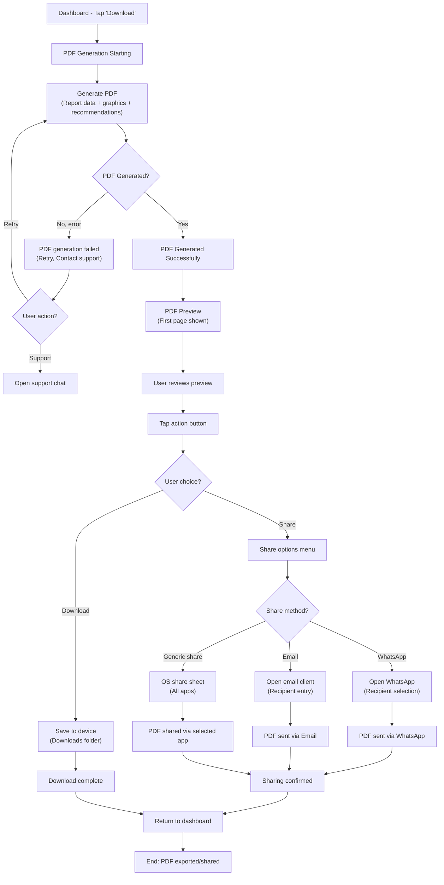

### Detailed Steps

| Step | User Action | System Response | Notes | Analytics Event |
|------|-------------|-----------------|-------|-----------------|
| 1 | Tap "Download Report" button on dashboard | Show "Generating PDF..." with progress indicator | N/A | `pdf_download_initiated` |
| 2 | Generate PDF document | Compile: Header (report date, user name), Summary stats (organ scores, key concerns), Full biomarker table, Organ system details, Concerns with explanations, Recommendations (diet, supplements, lifestyle), Medical disclaimer, Footer with analysis date | Include branding watermark (Long Health logo) | `pdf_generation_started` |
| 3 | PDF generation completes | Display PDF preview (first page visible, scrollable) | Preview shows accurate formatting and content | `pdf_generated` |
| 4 | View preview | User can scroll through preview to verify content | Show page count (e.g., "Page 1 of 4") | `pdf_preview_viewed` |
| 5 | Tap "Download" button | Save PDF to device's Downloads folder with filename format: "LongHealth_Report_[Date].pdf" (e.g., "LongHealth_Report_12Jan2024.pdf") | Allow rename before saving | `pdf_downloaded` |
| 6 | Tap "Share" button | Show share options: WhatsApp, Email, More (generic share sheet) | WhatsApp and Email are primary options | `pdf_share_initiated` |
| 7a | Select WhatsApp | Open WhatsApp app with PDF pre-attached as share attachment | User selects contact/group to send to | `pdf_shared_whatsapp` |
| 7b | Select Email | Open email client (Gmail, Outlook, etc.) with PDF as attachment | Pre-fill subject: "My Blood Test Analysis from Long Health" | `pdf_shared_email` |
| 7c | Select More | Show OS share sheet (iOS share sheet, Android chooser) with all installed apps | Users can share to any app supporting attachments | `pdf_shared_generic` |
| 8 | Confirm sharing | Show "Shared successfully" toast notification | Brief confirmation message | `pdf_share_completed` |
| 9 | Return to dashboard | Close share menu, return to dashboard | PDF link may be embedded in app history | `pdf_share_closed` |

### PDF Content Structure

```
┌─────────────────────────────────┐
│ LONG HEALTH                     │
│ Blood Test Analysis Report      │
│ 12 January 2024                 │
├─────────────────────────────────┤
│ Patient: John Doe               │
│ Age: 35 years | Gender: Male    │
│ Generated: 12 Jan 2024          │
├─────────────────────────────────┤
│ HEALTH SUMMARY                  │
│ Liver Health:     75% (Good)   │
│ Kidney Health:    60% (Caution)│
│ Heart Health:     85% (Good)   │
│ Lung Health:      70% (Good)   │
├─────────────────────────────────┤
│ TOP HEALTH CONCERNS             │
│ 1. Elevated Blood Glucose       │
│ 2. Low Vitamin D                │
├─────────────────────────────────┤
│ BIOMARKER DETAILS               │
│ [Full table]                    │
├─────────────────────────────────┤
│ RECOMMENDATIONS                 │
│ • Diet: ...                     │
│ • Supplements: ...              │
│ • Lifestyle: ...                │
├─────────────────────────────────┤
│ MEDICAL DISCLAIMER              │
│ This analysis is for educational│
│ purposes only...                │
├─────────────────────────────────┤
│ ©2024 Long Health               │
└─────────────────────────────────┘
```

### Medical Disclaimer

**Always include in PDF:**

> **MEDICAL DISCLAIMER**
>
> This health analysis is generated by Long Health's AI system and is intended for educational purposes only. It is NOT a substitute for professional medical advice, diagnosis, or treatment.
>
> **Important:**
> - Share this report with your doctor for professional interpretation
> - Do not make medical decisions solely based on this analysis
> - Consult a qualified healthcare professional for diagnosis and treatment
> - If you experience any health concerns, seek immediate medical attention
>
> Long Health assumes no liability for any health decisions made based on this analysis.

### Sharing Options

**Primary (iOS & Android):**
- WhatsApp (popular in India)
- Email (Gmail, Outlook, etc.)

**Secondary:**
- Generic share sheet (OS-native options)

**Do NOT include in Phase 1:**
- Facebook, Instagram, Twitter (privacy concerns for health data)
- Cloud storage (Dropbox, Google Drive) — Phase 2

### Filename Format
```
LongHealth_Report_[DD-Mon-YYYY]_[UserName].pdf
Example: LongHealth_Report_12-Jan-2024_JohnDoe.pdf
```

### Error Handling

| Error | User Message | Recovery |
|-------|--------------|----------|
| PDF generation timeout (>30s) | "PDF generation is taking longer. Please try again." | Retry button |
| Out of memory | "Unable to generate PDF. Please try again later." | Retry button + Contact support |
| Share failed | "Unable to share. Please try again." | Retry button |
| Device storage full | "Insufficient storage to download. Please free up space." | No retry (device issue) |

### UX Notes
- Show progress indicator during generation (indeterminate spinner, not progress bar)
- Preview should be swipeable (left/right to navigate pages)
- Provide "Share" button in preview screen as well
- Include visual watermark (Long Health branding) on every page
- Ensure PDF is properly formatted for mobile viewing
- Show file size before download (e.g., "~2 MB")
- Allow PDF naming customization before download
- Show download location confirmation ("Saved to Downloads")

### Analytics Events
- `pdf_download_initiated`
- `pdf_generation_started`
- `pdf_generated` (with file size, # pages)
- `pdf_generation_failed` (with error code)
- `pdf_preview_viewed` (with # pages viewed)
- `pdf_downloaded` (with file name)
- `pdf_share_initiated`
- `pdf_share_whatsapp_selected`
- `pdf_share_email_selected`
- `pdf_share_generic_selected`
- `pdf_shared_whatsapp` (with recipient count)
- `pdf_shared_email` (with recipient count)
- `pdf_shared_generic` (with app name)
- `pdf_share_completed` (with share method)
- `pdf_share_failed` (with error code)

### Accessibility Notes
- PDF generation progress: Announce via ARIA live region
- PDF preview: Ensure images have alt text describing biomarker visualizations
- Share button: Clear label, adequate size (48×48 dp)
- Download confirmation: Screen reader announces file name and size
- Error messages: High contrast, descriptive text (not just "Error")
- PDF itself: Ensure PDF is tagged (accessible structure) with proper heading hierarchy
- Color in PDF: Organ scores use both color and text labels (not color-alone distinction)

---

## 7. Profile Management Flow

### User Goal
User updates personal information (name, age, gender, height, weight) to ensure analysis accuracy.

### Flow Steps

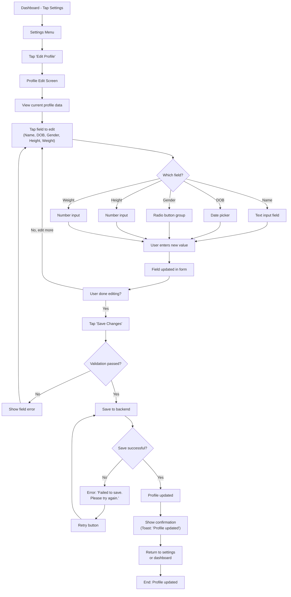

### Detailed Steps

| Step | User Action | System Response | Notes | Analytics Event |
|------|-------------|-----------------|-------|-----------------|
| 1 | Tap Settings icon/menu | Navigate to Settings screen | Show: Profile, App settings, Help, Logout | `settings_opened` |
| 2 | Tap "Edit Profile" | Navigate to profile edit screen | Show all profile fields with current values | `profile_edit_opened` |
| 3 | View current profile | Display: Name, DOB, Gender, Height, Weight in editable form | Show current values in each field | `profile_edit_viewed` |
| 4 | Tap name field | Activate text input, allow editing | Show max 50 characters, allow alphabets + spaces + hyphens | `profile_field_editing_started` (field: name) |
| 5 | Edit name | Clear previous value, enter new name | Real-time validation: non-empty | `profile_name_edited` |
| 6 | Tap DOB field | Open date picker (calendar modal) | Default to current DOB selection | `profile_dob_edit_started` |
| 7 | Change DOB | Select new date, confirm | Validate: Age 18+, not future date | `profile_dob_edited` |
| 8 | Tap gender field | Show radio button group: Male, Female, Other | Current selection pre-checked | `profile_gender_edit_started` |
| 9 | Change gender | Select new option | Single selection only | `profile_gender_edited` |
| 10 | Tap height field | Open number input (cm unit) | Show current height with hints (100-250 cm range) | `profile_height_edit_started` |
| 11 | Change height | Enter new height value | Validate: 100-250 cm range | `profile_height_edited` |
| 12 | Tap weight field | Open number input (kg unit) | Show current weight with hints (30-200 kg range) | `profile_weight_edit_started` |
| 13 | Change weight | Enter new weight value | Validate: 30-200 kg range | `profile_weight_edited` |
| 14 | Tap "Save Changes" | Submit updated profile to backend | Show loading spinner | `profile_save_initiated` |
| 15 | Backend validation | Validate all fields, check age 18+, ranges | If invalid: Return specific field error | `profile_validation_started` |
| 16 | Profile saved | Update user data in database, return success | Show "Profile updated" toast | `profile_saved` |
| 17 | Return to dashboard | Close edit screen, return to main view | Highlight which fields were changed | `profile_edit_closed` |

### Field Validation Rules

| Field | Rules | Error Message |
|-------|-------|---------------|
| Name | Non-empty, 2-50 chars, alphabets + spaces/hyphens | "Please enter a valid name (2-50 characters)" |
| DOB | Valid date, age 18+, not future date | "You must be at least 18 years old" |
| Gender | One of: Male, Female, Other | "Please select a gender" |
| Height | Integer 100-250 cm | "Height must be between 100-250 cm" |
| Weight | Integer 30-200 kg | "Weight must be between 30-200 kg" |

### Impact of Profile Changes

**When user updates profile, system should:**
1. **Recalculate reference ranges:** Different age/gender may have different normal ranges
2. **Re-analyze biomarkers:** Recalculate organ scores with new biometric data (height/weight affect BMI-based analysis)
3. **Update existing reports:** Show note "Profile updated on [date] — analysis recalculated"
4. **Show improvement badges:** If changes improve biomarker status (e.g., weight loss)

**Example:**
- User updates age from 35 to 40 → Reference ranges for some biomarkers change
- Show: "Your profile was updated. Analysis has been recalculated." (with updated organ scores)

### UX Notes
- Show which fields are editable vs. read-only
- Highlight recently changed fields
- Provide "Cancel" button to discard changes
- Show inline validation errors (red text below field, not dialog box)
- Use native pickers (date picker, gender radio buttons)
- Allow editing one field at a time or all fields together
- Show "Profile updated" toast only, no modal popup
- Maintain scroll position if editing multiple fields
- Show helpful hints below each field (e.g., "Height helps us calculate BMI")

### Analytics Events
- `settings_opened`
- `profile_edit_opened`
- `profile_edit_viewed`
- `profile_field_editing_started` (with field name)
- `profile_name_edited`
- `profile_dob_edit_started` / `profile_dob_edited`
- `profile_gender_edit_started` / `profile_gender_edited`
- `profile_height_edit_started` / `profile_height_edited`
- `profile_weight_edit_started` / `profile_weight_edited`
- `profile_validation_error` (with field, error code)
- `profile_save_initiated` (with # fields changed)
- `profile_saved` (with fields changed)
- `profile_edit_closed` (with # changes saved)
- `profile_recalculation_triggered` (if biomarkers affected)

### Accessibility Notes
- Form labels: Use semantic labels tied to inputs via `for` attribute
- Required fields: Mark with asterisk (*) and aria-required="true"
- Date picker: Keyboard navigable, announce selected date
- Radio buttons: Proper grouping, announce selected option
- Number inputs: Use input type="number" with min/max, allow spinner buttons
- Validation errors: Announce via aria-live="polite" with color + text
- Touch targets: 48×48 dp for all input fields
- Focus management: Keep focus on field after edit, announce changes
- Save button: Clear label, announce loading state during save

---

## 8. Error & Recovery Flows

### User Goal
Handle common error scenarios gracefully with clear error messages and recovery paths.

### Error Scenarios Mapped

#### 8.1 OTP Verification Errors

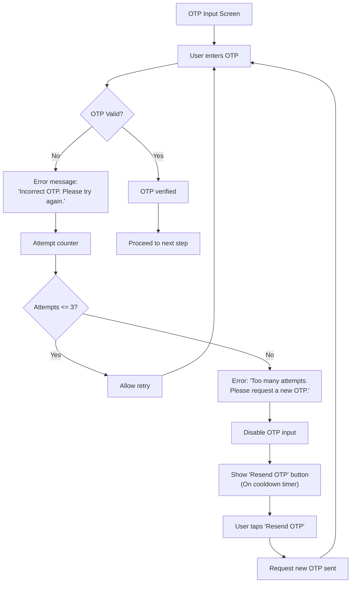

| Error | User Message | Recovery | Time |
|-------|--------------|----------|------|
| Invalid OTP | "Incorrect OTP. Please try again. (Attempt 1/3)" | Tap field, try again | Immediate |
| Invalid OTP (attempt 3) | "Too many attempts. Please request a new OTP." | Tap "Resend OTP" button | Immediate |
| OTP expired | "OTP expired. Please request a new one." | Tap "Resend OTP" button | Immediate |
| OTP not received | Show prominent "Resend OTP" button + help | Tap "Resend" or open support chat | 30s cooldown |
| Phone number invalid | "Phone number not recognized. Please check and try again." | Tap to go back, re-enter number | Immediate |

#### 8.2 File Upload Errors

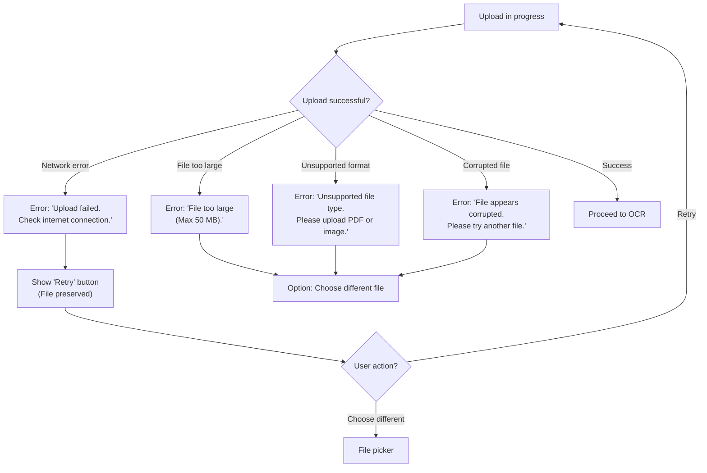

| Error | User Message | Recovery | Notes |
|-------|--------------|----------|-------|
| Network timeout | "Upload failed. Check your internet connection and try again." | Retry button (file preserved) | Shows offline indicator |
| File too large | "File is too large (max 50 MB). Please upload a smaller file." | Choose different file | Helpful size info |
| Unsupported format | "Unsupported file type. Please upload a PDF or image (JPG, PNG, TIFF)." | Choose different file | List supported formats |
| Corrupted file | "The file appears to be corrupted. Please try another file." | Choose different file | Clear error message |
| Device storage full | "Your device storage is full. Please free up space and try again." | Device setting, try later | No upload button available |

#### 8.3 OCR Extraction Errors

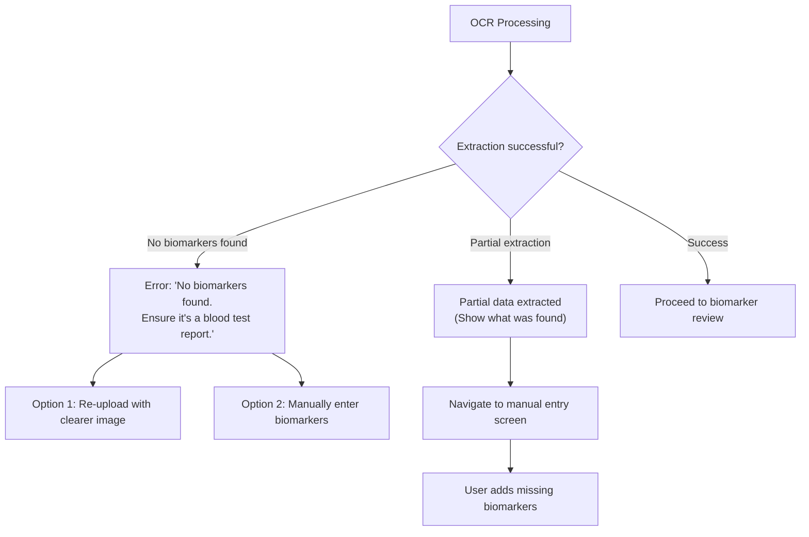

| Error | Scenario | User Message | Recovery |
|-------|----------|--------------|----------|
| No biomarkers | Document quality poor, non-lab PDF | "We couldn't extract biomarkers. Ensure it's a blood test report." | Re-upload with clearer image OR manually add |
| Partial extraction | <50% biomarkers found | "We found [N] biomarkers. Please review and add any missing values." | Manual entry modal |
| OCR timeout | Processing takes >60s | "Analysis is taking longer. Please wait or try again." | Retry after 10s wait |
| Lab not recognized | Unknown lab format | "Lab format not recognized. Please manually verify values." | Manual review required |

#### 8.4 AI Analysis Errors

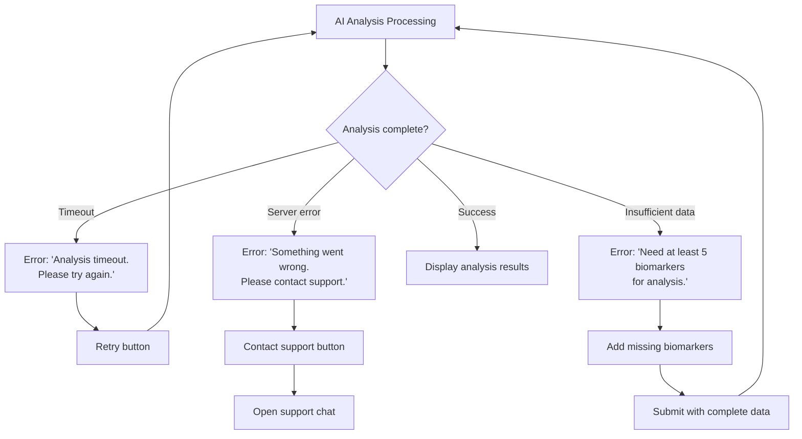

| Error | Scenario | User Message | Recovery |
|-------|----------|--------------|----------|
| Analysis timeout | Server overloaded, network delay | "Analysis is taking longer. Please try again." | Retry button |
| Server error | Backend crash, DB issue | "Something went wrong. Please contact our support team." | Contact support button |
| Insufficient data | <5 biomarkers extracted | "We need at least 5 biomarkers to generate analysis. Please add missing values." | Add biomarkers, retry |
| Invalid biomarker combo | Conflicting values | "Please review biomarker values for accuracy and try again." | Manual correction screen |

#### 8.5 Session & Authentication Errors

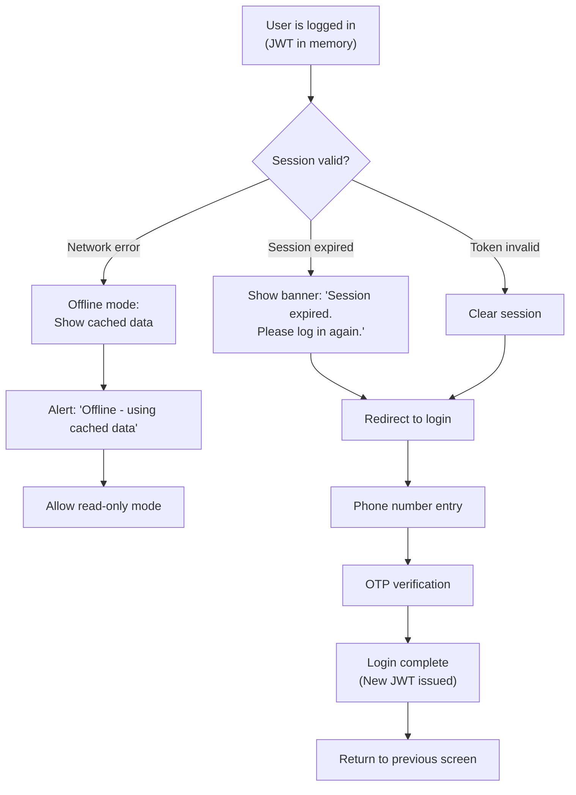

| Error | Scenario | User Message | Recovery |
|-------|----------|--------------|----------|
| Session expired | JWT token older than 30 days | "Session expired. Please log in again." | Redirect to login → OTP → Dashboard |
| Token invalid | Corrupted token in storage | "Please log in again." | Clear token, redirect to login |
| Unauthorized | User not found in DB | "Account not found. Please contact support." | Contact support OR sign up |
| Offline | No network connection | "You're offline. Using cached data." | Retry button when online |

#### 8.6 Network & Connectivity Errors

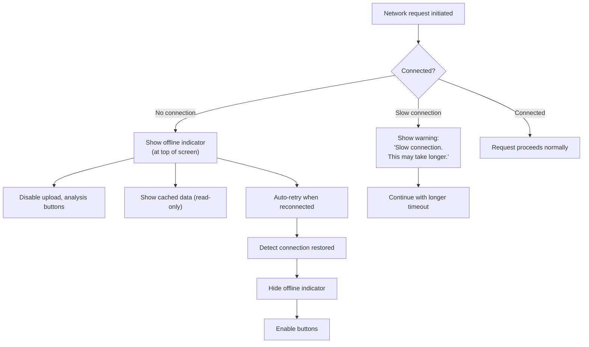

| Scenario | User Message | Behavior | Notes |
|----------|--------------|----------|-------|
| No internet | "No internet connection." (banner at top) | Offline mode, disable upload/share, show cached data | Auto-retry when connected |
| Poor connection | "Your connection is slow. This may take longer." (toast) | Allow retry, longer timeout (90s), disable if >120s | Continue or cancel |
| Connection lost mid-upload | "Connection lost. Retry?" | Preserve file, show retry button | Clear error when reconnected |

#### 8.7 Data Validation Errors

| Field | Invalid Input | Error Message | Example |
|-------|----------------|---------------|---------|
| Phone | Not 10 digits | "Please enter a valid 10-digit phone number." | "12345" → Error |
| DOB | Future date | "Please enter a valid date of birth." | "2025-01-01" → Error |
| Age | <18 years | "You must be at least 18 years old." | Age 15 → Error |
| Height | <100 or >250 cm | "Height must be between 100-250 cm." | 80 cm → Error |
| Weight | <30 or >200 kg | "Weight must be between 30-200 kg." | 250 kg → Error |
| Name | Empty or <2 chars | "Please enter a valid name." | "" → Error |
| Biomarker value | Non-numeric | "Please enter a valid number." | "abc" → Error |

### Recovery Patterns

**Pattern 1: Simple Retry**
- Error message
- "Retry" button
- File/data preserved
- Example: Upload failed due to network

**Pattern 2: User Correction**
- Error message with specific guidance
- "Back" or "Edit" button
- Show problematic field
- Example: Invalid phone number format

**Pattern 3: Alternative Action**
- Error message
- Multiple recovery options (e.g., Retry, Try different file, Contact support)
- Example: OCR failed → re-upload OR manually enter

**Pattern 4: Manual Bypass**
- Error message
- "Proceed manually" or "Skip" option
- Example: OCR partial → allow manual biomarker entry

### UX Notes
- **Error messages:** Clear, concise, non-technical language
- **Color:** Red text with error icon (not red background)
- **Placement:** Inline for form fields, banner for full-screen, toast for temporary
- **Recovery CTA:** Obvious button (Retry, Try again, Contact support)
- **Data preservation:** Never lose user data on error (keep form values, files, etc.)
- **Support escalation:** Always provide "Contact support" option for unrecoverable errors
- **Offline handling:** Show offline indicator, allow read-only access
- **Retry logic:** Exponential backoff (1s, 2s, 4s) for network retries

### Analytics Events
- `error_otp_invalid` (with attempt #)
- `error_otp_max_attempts` (locked)
- `error_otp_expired`
- `error_upload_failed` (with reason: network, file size, format, corrupt)
- `error_ocr_failed` (with reason: no biomarkers, poor quality, timeout)
- `error_ocr_partial` (with # found, # missing)
- `error_analysis_failed` (with reason: timeout, server error, insufficient data)
- `error_session_expired`
- `error_network_offline`
- `error_validation_failed` (with field, error type)
- `error_recovery_initiated` (with method: retry, manual entry, contact support)
- `error_recovery_successful` (with error type, recovery method)

### Accessibility Notes
- Error messages: Use aria-live="polite" for live region announcement
- Error icons: Provide text alternative (not icon-only)
- Form errors: Link label to error message via aria-describedby
- Color: Never rely on color alone (use icon + text)
- Contrast: Error text 4.5:1 ratio minimum
- Focus: Move focus to error field when validation fails
- Recovery buttons: Clear, descriptive labels (e.g., "Retry upload" not just "Retry")

---

## 9. Returning User Flow

### User Goal
User opens app, auto-logs in if possible, and quickly accesses dashboard with latest report.

### Flow Steps

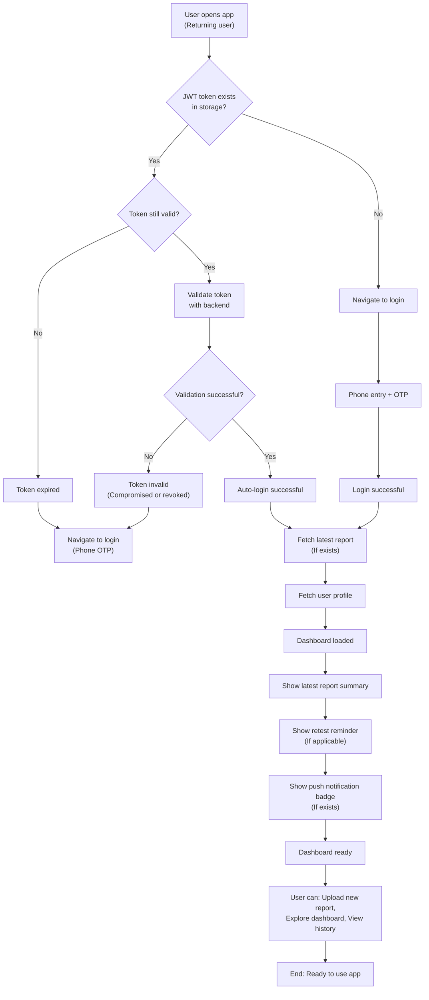

### Detailed Steps

| Step | User Action | System Response | Notes | Analytics Event |
|------|-------------|-----------------|-------|-----------------|
| 1 | User opens app (second+ time) | Check for stored JWT token in secure storage | App delegates to login/auth service | `app_opened` (with session type: returning) |
| 2 | Check token validity | Verify token exists and hasn't expired (30-day expiry) | Token stored in secure local storage (NSUserDefaults/Keychain on iOS, SharedPreferences on Android) | `token_check_initiated` |
| 3 | Token found & valid | Validate token with backend (ping /auth/verify endpoint) | Quick validation call (<1s) | `token_validation_started` |
| 4 | Validation succeeds | Backend confirms token is valid, user is authenticated | No re-auth needed | `token_validated` |
| 5 | Fetch user data | Get latest report (if exists) and user profile from DB | Parallel requests: GET /reports?limit=1 + GET /profile | `user_data_fetching` |
| 6 | Dashboard loads | Display cached data if available while fetching fresh data | Show skeleton loaders for latest report | `dashboard_loading` |
| 7 | Latest report loaded | Display summary: Report date, organ scores, key findings | Pre-load organ detail cards (non-blocking) | `latest_report_loaded` |
| 8 | Check retest reminder | If retest due (based on last report date), show reminder banner | Reminder logic: "Last test on [date], retest recommended on [date]" | `retest_reminder_checked` |
| 9 | Show push notifications | Display badge for any pending notifications (new feature, health tips, retest reminder) | Notification center integration | `push_notifications_loaded` |
| 10 | Dashboard ready | User can immediately interact with dashboard | All data loaded, no blocking waits | `dashboard_ready` |
| 11 | Token invalid/expired | Show "Please log in again" message | Navigate to login/OTP flow | `token_invalid` |
| 12 | Network error during validation | Fall back to cached data (if available) with offline indicator | Show "Offline - using cached data" banner | `validation_failed_offline` |

### Token Management

**Token Storage:**
- **iOS:** Keychain (secure, persistent)
- **Android:** EncryptedSharedPreferences (secure, persistent)
- **Web:** HttpOnly secure cookie (auto-refresh via silent token refresh)

**Token Expiry:**
- **Access token:** 24 hours
- **Refresh token:** 30 days
- **Session warning:** Show "Session expiring soon" at 24hr mark if user offline

**Token Refresh:**
- Refresh automatically when access token expires (silent refresh, no user action)
- If refresh fails → redirect to login

### Returning User Experience

**Scenario 1: Active user (last opened < 7 days)**
- Token valid, auto-login
- Dashboard loads instantly with latest report
- Show push notification badges
- Optional: Show trending notifications or health tips

**Scenario 2: Inactive user (last opened 7-30 days)**
- Token valid, auto-login (within 30-day window)
- Dashboard loads with cached data
- Fetch fresh data in background, update silently
- Show "Retest reminder" banner

**Scenario 3: User after 30 days**
- Token expired
- Redirect to login → OTP verification
- After login, load dashboard with latest report

### Push Notifications

**Retest Reminder:**
- Timing: 14 days after last report
- Title: "Time for your health check"
- Body: "It's been [N] days since your last test. Upload a new report to see trends."
- CTA: Tap to open upload screen

**Feature Announcements (Phase 1+):**
- New features in app
- Health tips (food, exercise recommendations)
- Seasonal health advice (heat stroke prevention, etc.)

**Opt-in/Opt-out:**
- Default: Opt-in for retest reminders
- User can disable in Settings → Notifications

### Quick Actions on Dashboard

When user opens app:
1. **Latest Report Card:** Shows summary, with "View details" CTA
2. **Upload New Report:** Prominent button, one-tap to upload flow
3. **Health Insights:** "Your latest concerns", "Recommended actions" (1-2 items)
4. **Retest Reminder:** "You're due for your next test" (if applicable)

### Cached Data Strategy

**What to cache:**
- User profile (name, age, gender, height, weight)
- Latest report (full analysis, organ scores, concerns, recommendations)
- Report history (list of all report dates)

**Cache expiry:**
- User profile: 7 days or on explicit update
- Reports: 1 day (fresh data on each open)

**Cache behavior:**
- If online: Fetch fresh, update cache in background
- If offline: Show cached data with "Using cached data" banner
- If cache older than 7 days and offline: Show warning "Data may be outdated"

### UX Notes
- Show loading skeleton while dashboard data is fetching (non-blocking)
- Pre-load organ detail cards (lazy load on demand)
- Smooth transition from splash screen to dashboard
- Keep notification badges visible on app icon (iOS: badge count, Android: notification dot)
- Show "Welcome back, [Name]!" message on first load
- Offer "What's new?" tip if this is user's first app open in 14+ days

### Analytics Events
- `app_opened` (with session type: new, returning)
- `token_check_initiated`
- `token_validation_started`
- `token_validated` / `token_invalid` / `token_expired`
- `user_data_fetching`
- `dashboard_loading`
- `latest_report_loaded` (with report date, age of report)
- `retest_reminder_checked` (with reminder status: due, not due, overdue)
- `retest_reminder_shown` (if triggered)
- `push_notifications_loaded` (with # notifications)
- `notification_tapped` (with notification type)
- `dashboard_ready` (with load time in ms)
- `offline_mode_activated` (with cached data age)

### Accessibility Notes
- Loading states: Announce "Loading dashboard" via aria-live="polite"
- Skeleton loaders: Provide text alternative (announce "Content loading")
- Retest reminder: Announce as banner with role="alert"
- Push notifications: Allow users to disable via screen reader
- Auto-login: Don't move focus until dashboard ready (wait for page stability)
- Offline banner: High contrast, clear dismissal option
- Touch targets: Notification badges, upload button 48×48 dp minimum

---

## 10. Family Profile Flow (Should-Have — Phase 1.5+)

### User Goal
User can create separate profiles for family members, upload their reports, and compare health trends across family.

### Flow Steps

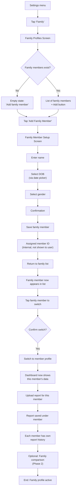

### Detailed Steps

#### Add Family Member

| Step | User Action | System Response | Notes | Analytics Event |
|------|-------------|-----------------|-------|-----------------|
| 1 | Tap "Family" in settings | Navigate to family profiles screen | Show current profiles (primary + family) | `family_screen_opened` |
| 2 | View family list | Display primary user profile (editable) + family members (with actions) | Primary user highlighted as "You" | `family_list_viewed` |
| 3 | Tap "Add Family Member" | Navigate to add member form | Show: Name, DOB, Gender fields | `add_family_member_initiated` |
| 4 | Enter member name | Text input with validation | Max 50 characters, alphabets + spaces/hyphens | `family_member_name_entered` |
| 5 | Select member DOB | Date picker | Default to 30 years ago from today | `family_member_dob_selected` |
| 6 | Select member gender | Radio button group: Male, Female, Other | Single selection | `family_member_gender_selected` |
| 7 | Review member info | Show summary before saving | Allow edit fields before confirming | `family_member_review_viewed` |
| 8 | Tap "Save Member" | Create member profile in DB, assign unique member ID | Return to family list | `family_member_created` |
| 9 | View updated family list | Show newly added member in list | Show member name, age, gender | `family_list_updated` |

#### Switch Between Profiles

| Step | User Action | System Response | Notes | Analytics Event |
|------|-------------|-----------------|-------|-----------------|
| 1 | Tap family member card | Show confirmation: "Switch to [member name]'s profile?" | Highlight member being switched to | `family_profile_switch_initiated` |
| 2 | Confirm switch | Update app context to selected member | Show loading spinner briefly | `family_profile_switched` |
| 3 | Dashboard loads | Show that member's latest report (if exists) | All tabs now show member's data | `family_dashboard_loaded` |
| 4 | Header shows member | Display "[Member name]'s Health" or similar | Show "Switch profile" option | `family_member_indicated` |
| 5 | Tap back to primary | Switch back to own profile | Same flow as above | `family_profile_switched_back` |

#### Upload Report for Family Member

| Step | User Action | System Response | Notes | Analytics Event |
|------|-------------|-----------------|-------|-----------------|
| 1 | On family member's dashboard | Tap "Upload Report" | Same upload flow as primary user | `family_member_upload_initiated` |
| 2 | Upload process | File upload → OCR → Biomarker review → Analysis | Process identical to primary user | `family_member_upload_processing` |
| 3 | Analysis complete | Show report analysis for family member | Report saved under that member's ID | `family_member_report_created` |
| 4 | Report history | Member's reports appear in "My Reports" tab | Chronological list for that member only | `family_member_reports_listed` |

### Profile Switching UI

**Dashboard Header (after switch):**
```
┌────────────────────────┐
│ Long Health            │
│ John Doe's Health      │ ← Indicates active member
│ (Switch profile →)     │ ← Tap to change member
└────────────────────────┘
```

**Family Menu (Settings):**
```
Profile:
├── You (John Doe) [Primary]
│   ├── Edit profile
│   └── Switch to this profile
├── Family Member (Priya Doe, 8)
│   ├── Edit profile
│   └── Switch to this profile
├── Family Member (Rana Doe, 35)
│   ├── Edit profile
│   └── Switch to this profile
└── Add family member
```

### Data Structure

**For each family member:**
- Member ID (unique)
- Name
- DOB
- Gender
- Height (optional — can be added later)
- Weight (optional — can be added later)
- Reports list (array of report IDs)
- Created date
- Relationship to primary user (Phase 2: spouse, child, parent, sibling)

### Limitations in Phase 1

**What's NOT included:**
- Relationship/family tree (Phase 2)
- Family health comparison (Phase 2)
- Shared recommendations (Phase 2)
- Genetic risk factors (Phase 2)
- Family health history (Phase 2)

### UX Notes
- Show family member's age prominently (helps with context)
- Profile switching should be smooth (1-2s)
- Show currently active profile clearly in header
- Allow editing family member details (name, DOB, gender)
- Optional: Profile photos/avatars for quick identification (Phase 2)
- Show quick profile switcher in main menu/dashboard header
- Allow 5+ family members (no hard limit)
- Show "Shared with [family member]" indicator (Phase 2)

### Analytics Events
- `family_screen_opened`
- `family_list_viewed` (with # members)
- `add_family_member_initiated`
- `family_member_name_entered`
- `family_member_dob_selected`
- `family_member_gender_selected`
- `family_member_review_viewed`
- `family_member_created` (with age, gender)
- `family_list_updated` (with # members)
- `family_profile_switch_initiated` (with member name)
- `family_profile_switched` (with member name, # reports)
- `family_dashboard_loaded` (with member name, # reports)
- `family_member_indicated` (with member name)
- `family_profile_switched_back`
- `family_member_upload_initiated` (with member name)
- `family_member_upload_processing` (with member name)
- `family_member_report_created` (with member name)
- `family_member_reports_listed` (with member name, # reports)

### Accessibility Notes
- Family list: Use semantic list with proper heading
- Member cards: Buttons with aria-label="Switch to [member name]'s profile"
- Profile switcher: Announce current member via aria-live region
- Age display: Always show DOB or age (not just in hover)
- Edit buttons: Clear, distinguishable from switch buttons
- Touch targets: 48×48 dp for member cards
- Focus management: Maintain focus on active member when switching
- Confirmation: Announce profile switch via aria-live="polite"

---

## Navigation & Information Architecture

### Main Navigation Structure

```
Long Health App
│
├── Dashboard (Home)
│   ├── Overview Tab
│   │   ├── Organ System Scores (4-6 cards)
│   │   └── Biomarker Details (with trends)
│   ├── Concerns Tab
│   │   ├── Prioritized Concerns List
│   │   └── Concern Details
│   ├── Recommendations Tab
│   │   ├── Diet Recommendations
│   │   ├── Supplement Recommendations
│   │   └── Lifestyle Recommendations
│   └── My Reports Tab
│       ├── Report List (chronological)
│       ├── Report Details
│       └── Comparison View (if 2+ reports)
│
├── Settings
│   ├── Edit Profile (name, DOB, gender, height, weight)
│   ├── Family Profiles (add, switch, manage members)
│   ├── Notifications (push notification preferences)
│   ├── Help & Support (FAQ, contact support)
│   ├── About (app version, legal, privacy policy)
│   └── Logout
│
└── Upload Report (floating action button or tab button)
    ├── Camera capture
    ├── Image/PDF picker
    └── Upload → OCR → Review → Analysis
```

### Bottom Tab Navigation (Mobile)

```
┌─────────────────────────────────┐
│ Dashboard  Concerns  My Reports  │
│    (home)   (second tab)         │
│                            [≡]   │ ← Settings menu
└─────────────────────────────────┘
      Tab 1      Tab 2     Tab 3
  (Overview,  (Prioritized (Report
   Organ      Concerns &   History &
   Scores,    Recs)        Trends)
   Trends)
```

---

## Cross-Cutting Concerns

### Session Management

- **Session timeout:** 30 days (access token refresh)
- **Silent refresh:** Auto-refresh if online, prompt if offline
- **Session persistence:** Tokens stored in secure local storage
- **Logout:** Clear tokens, redirect to login

### Offline Support

- **Cached data:** Latest report, user profile, report history
- **Offline mode:** Read-only access to cached data
- **Offline indicator:** Banner at top showing "You're offline"
- **Auto-sync:** Resume syncing when reconnected

### Analytics & Tracking

Every flow includes analytics events at key steps:
- User action (tap, input)
- System response (load, success, error)
- Decision points (user choice)
- Error recovery (retry, manual entry)

**Sample events:**
- `onboarding_started`, `onboarding_completed`
- `upload_initiated`, `upload_failed`, `analysis_completed`
- `dashboard_viewed`, `concern_tapped`, `recommendation_viewed`
- `pdf_downloaded`, `pdf_shared_whatsapp`
- `error_recovery_successful`

### Push Notifications

- **Retest reminders:** 14 days after last report
- **Feature announcements:** New features or health tips
- **Opt-in/opt-out:** Settings → Notifications

### Medical Disclaimers

Always include:
- On report screens
- On PDF exports
- On recommendation screens
- On concern detail screens

Standard text:
> "This analysis is for educational purposes only. Please consult a healthcare professional for medical advice."

---

## Glossary & Definitions

| Term | Definition |
|------|-----------|
| **Biomarker** | A measurable substance in blood that indicates health status (e.g., Glucose, Hemoglobin) |
| **Organ System** | Group of organs with related function (e.g., Liver, Kidney, Heart, Lungs) |
| **Reference Range** | Normal range of a biomarker value for a specific age/gender |
| **OCR** | Optical Character Recognition — extracting text from images/PDFs |
| **JWT** | JSON Web Token — secure authentication token stored on client |
| **OTP** | One-Time Password — 6-digit code sent via SMS for phone verification |
| **Trend** | Change in biomarker value across multiple reports over time |
| **Concern** | Health issue identified by AI analysis based on biomarker patterns |
| **Recommendation** | Actionable advice (diet, supplement, lifestyle) to address a concern |

---

## Conclusion

This User Journey Workflows document provides comprehensive guidance for implementing Long Health Phase 1 MVP. Each flow includes:
- **Step-by-step detailed actions** for both user and system
- **Error handling & recovery paths** for common failure scenarios
- **Analytics tracking** at critical junctures
- **Accessibility considerations** for screen readers and keyboard navigation
- **UX best practices** including loading states, empty states, and microcopy

**Key Principles:**
- Keep onboarding < 2 minutes
- Process reports in < 90 seconds
- Support offline mode with cached data
- Always provide recovery paths for errors
- Prioritize medical accuracy with disclaimers
- India-localize all recommendations (diet, supplements, lifestyle)
- Track everything for funnel analysis and optimization

---

**Document Version:** 1.0  
**Created:** 2026-04-08  
**Status:** Ready for implementation  
**Next Steps:** Convert flows to wireframes/prototypes, then implement in development
